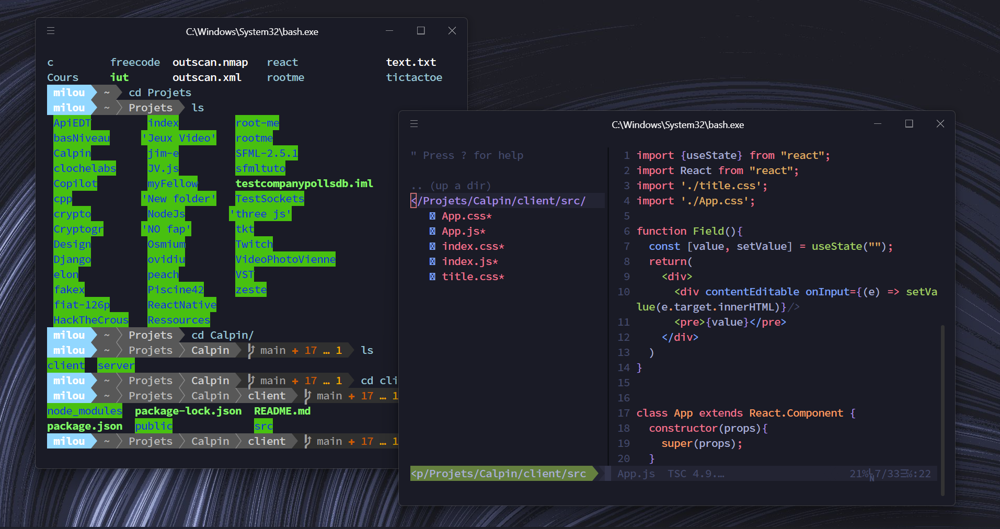

# Fichier de Config (NeoVim & Powerline)
*Ce fichier de configuration est susceptible de changer avec le temps car je travaille actuellement avec `WSL`. Le jour où je passerais à Linux à plein temps j'écrirais une configuration en lua.*
## Description
- OS & bash : Debian + WSL + Hyper
- Theme : tokyonight (nvim) + NORD (bash)
- Langages supportés : 
  - Javascript/JSX
  - HTML/CSS
  - Python
  - C/C++
## Screenshot

